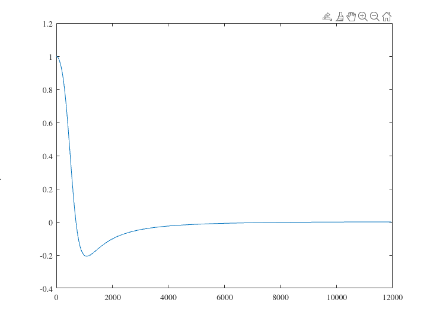

## Identifying noise
In order to filter the noise in the audio file provided (`noisyconversation.wav`), it was important to first identify the frequencies in the file. The MATLAB function `fft` worked perfecty for this since I wanted to use a Fourier transform. After running the audio through the Fourier transform, I got an output that looked like this: 

## Removing noise
Since I wanted to remove the noise, I did some research and found that most human voice frequencies are in the 800-1000 Hz range. This lined up with the results of my Fourier transform, so I set the Butterworth filter to be a low pass filter with a cutoff frequency of 700Hz. I used the `butter` function in MATLAB and saved the output as a file (`cleanedconversation.wav`).

## After filter
After applying the Butterworth filter, I performed a Fourier transform in order to check if I correctly removed the noise. This is shown in the following plot:

### DFT

### Frequency Response

\clearpage
## Closing notes
I realize this is not part of the assignment, but I just wanted to say that I was a little confused about the application for most of the principles we learned in class. They seemed too mathematically intensive for me to actually use. Using the Butterworth filter as a low pass filter in combination with a Fourier transform in order to remove noise from this file was also really confusing until I actually did it. While I may never become an expert in signal processing, this project opened my eyes to how I can use filters with programming in order to do interesting and useful things. Thank you.
